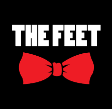
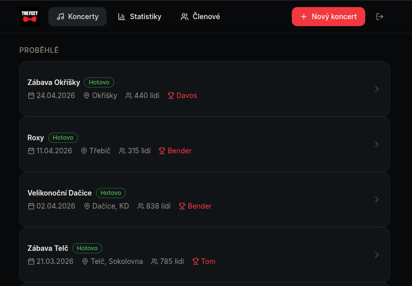
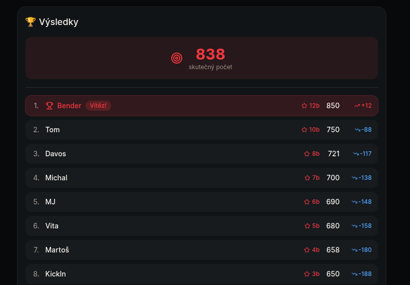
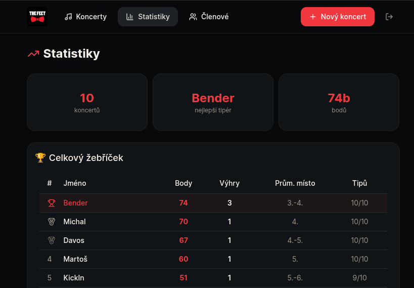

<p align="center">
  
</p>

<h1 align="center">The Feet — Gig Attendance Guessing Game</h1>

<p align="center">
  A fun internal app for <strong>The Feet</strong> band members and crew to guess how many people will show up at each gig. The closest guess wins!
</p>

---

## How It Works

Before each gig, band members and crew submit their attendance guesses. After the show, the actual headcount is revealed and everyone is ranked by how close their guess was. Points are awarded based on placement, and a running leaderboard tracks the best guessers across the entire season.

## Screenshots

<p align="center">
  
</p>
<p align="center"><em>Gig overview — upcoming and past shows with winners</em></p>

<br/>

<p align="center">
  
</p>
<p align="center"><em>Gig results — actual attendance, rankings, and point deltas</em></p>

<br/>

<p align="center">
  
</p>
<p align="center"><em>Season leaderboard with total points, wins, and average placement</em></p>

## Tech Stack

- **Next.js 16** with App Router
- **React 19** + **TypeScript**
- **Tailwind CSS 4** + **shadcn/ui**
- **Google Sheets API** as the database

## Getting Started

```bash
# Install dependencies
npm install

# Set up environment variables
cp .env.example .env.local
# Fill in your Google Sheets credentials

# Run the dev server
npm run dev
```

Open [http://localhost:3000](http://localhost:3000) to start guessing.

## License

Private project for The Feet band.
